# Neo4J_MLM
### Basic summary
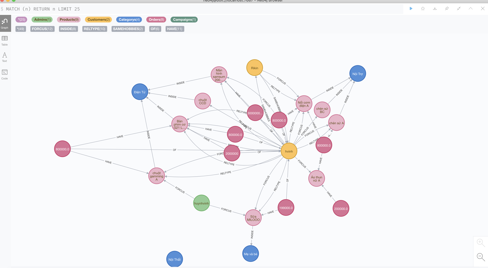

### What is Neo4j ?

- Neo4j is a graph database.

- In relational databases like SQL Server, MySQL, or Oracle, an entity like "MonHoc" (subject) with its properties is described using a table consisting of multiple columns, where the table name represents the entity and the columns describe the properties of the entity. Relationships between entities are built by recording the information of the parent entity into the child entity.

- In Neo4j, entities are represented as vertices (nodes) of the graph, where the properties of the entity are described through the attributes of the node. The relationships between entities are depicted by links between nodes.

- As a graph database, Neo4j's storage model, storage structure, and object characteristics are tailored for graph databases in general. This means that Neo4j stores data on nodes and constructs various data structures using relationships.

### Application

- Neo4j, as a graph database, is commonly used to describe information networks such as social networks, sensor networks,etc. where data is represented as entities (vertices) on a directed graph.
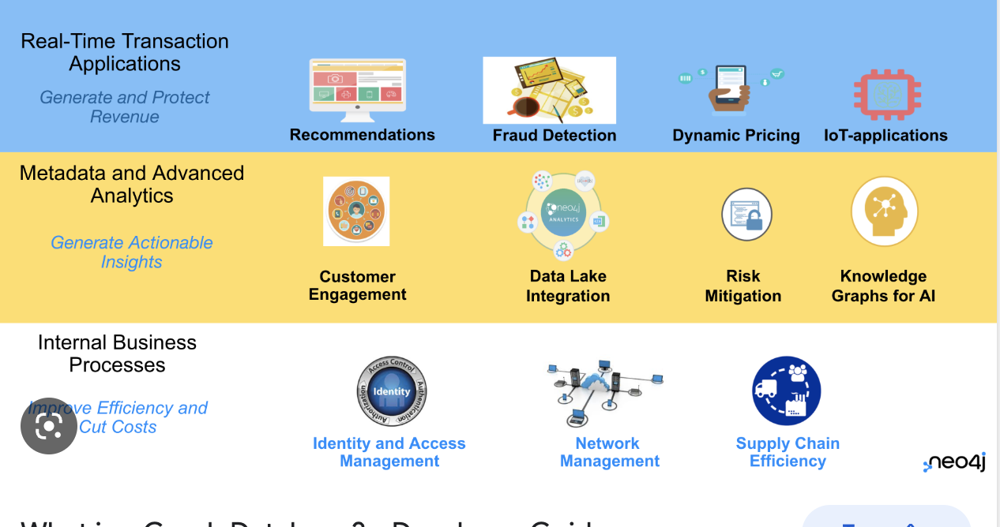

### Node

- Nodes are commonly used to represent entities. The simplest graph is one where there is only one node.

### Label

- Labels can be used to model the domain of values for nodes, typically grouping nodes with the same data type or property into a set and then assigning labels to them.

- For example, all nodes representing a user object can be labeled as "Users". Then, you can conveniently work with Neo4j through these labeled nodes, such as finding all users with a name matching "ABC".

- Each node can have one or more labels. To represent different dimensions of data, you can add labels to nodes accordingly.

### Properties

- Simple put, nodes and relationships can both have data written onto them( in JSON format). In theory:
        - Properties are a name-values pair used to represent attributes of nodes as well as relationships. Properties can store various data types such as number, string, and boolean with corresponding value domains.

### Query Language Cypher

- Similar to the SQL

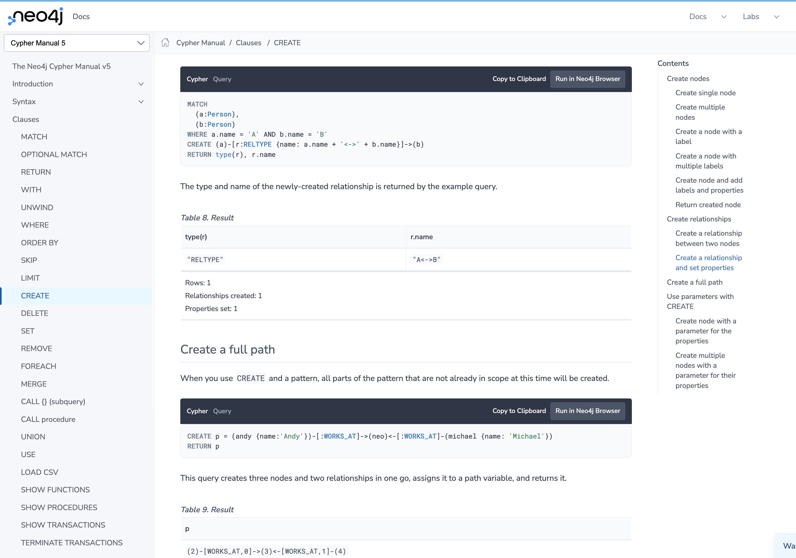

example:
    - create node:
    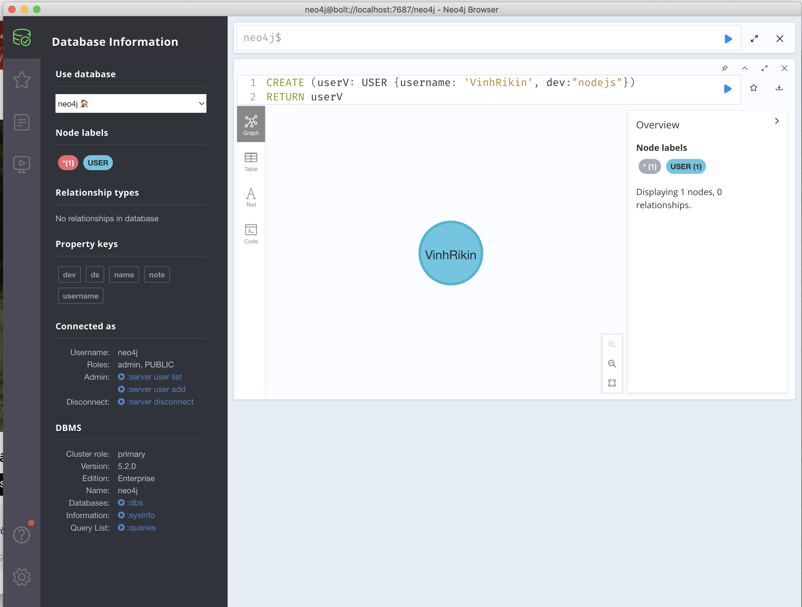
    - create relationship:
    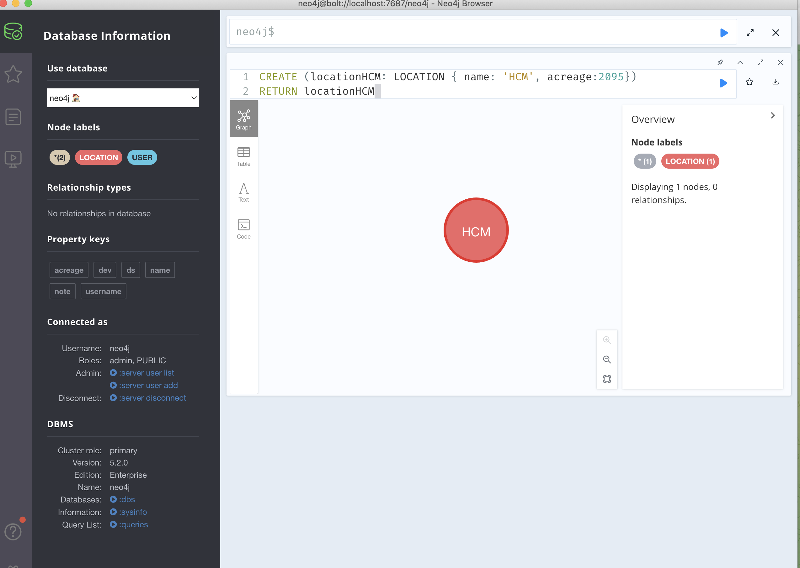
    - MATCH (userV:USER), (cityHCM:LOCATION) WHERE userV.username = 'VinhRikin' AND cityHCM.name = 'HCM' CREATE (userV)-[r:LIVE {value: 4}]->(cityHCM) RETURN r
    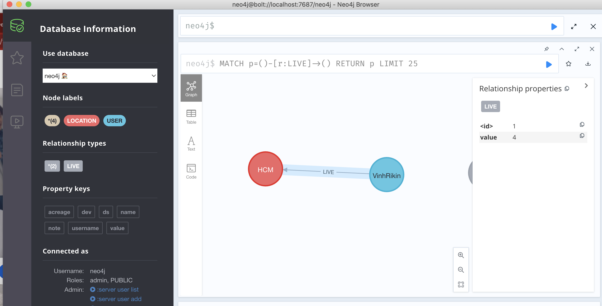

### Algorithm groups

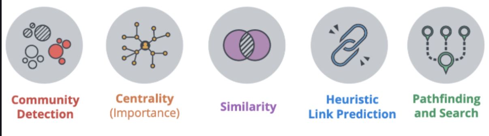

### II. Using Neo4j to Build a Multi-Level Marketing System
-  What is Multi-Level Marketing?
    Multi-level marketing (MLM), also known as network selling or MLM, is a strategy aimed at maximizing sales through a network of distributors. Distributors are compensated for both selling products themselves and for recruiting others to sell. It operates through a hierarchical structure where distributors are placed under higher-level distributors or agents who recruit them, and higher levels typically receive higher compensation. Therefore, the earlier one joins, the larger their downstream network and potential earnings.
    Example of an MLM Model in World of Warcraft:
    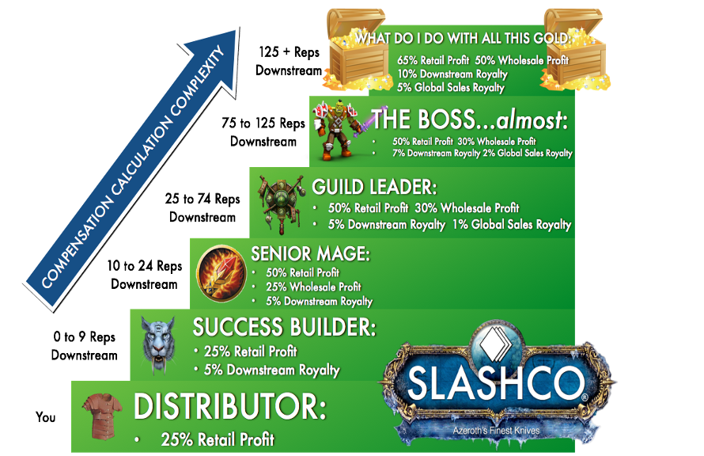
- The multi-level marketing model consists of four common sources of income:
    - Direct Sales: For each item a team member sells directly, they receive a commission.
    - Downstream Royalty: A percentage of the income from the retail price of items sold by individuals "below them," meaning those they have recruited to work and expand to those recruited by their recruits.
    - Wholesale Profit: A percentage of the income from goods sold to those "below them" (these goods are then resold to consumers).
    - Global Sales Royalty: A percentage of all sales revenue generated by individuals within the system (also known as revenue sharing).

- Neo4j Modeling of Multi-Level Marketing Business

    * Utilizing the multi-level marketing dataset within World of Warcraft for illustration:

    Sales Incentive Data Model:
    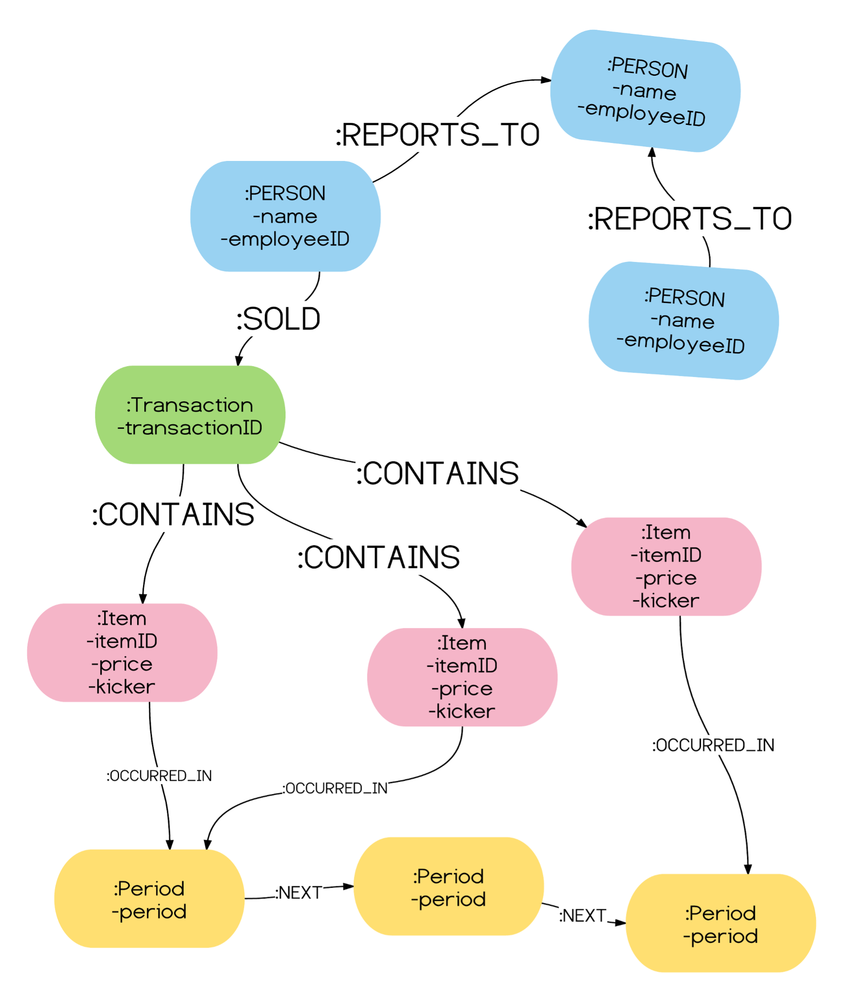
    Some Cypher queries for querying the multi-level marketing graph database:
    • Who has sold the most products:
    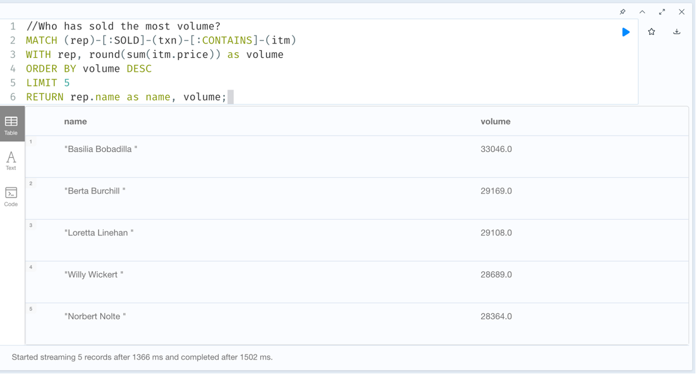
    • Who has closed the largest deal:
    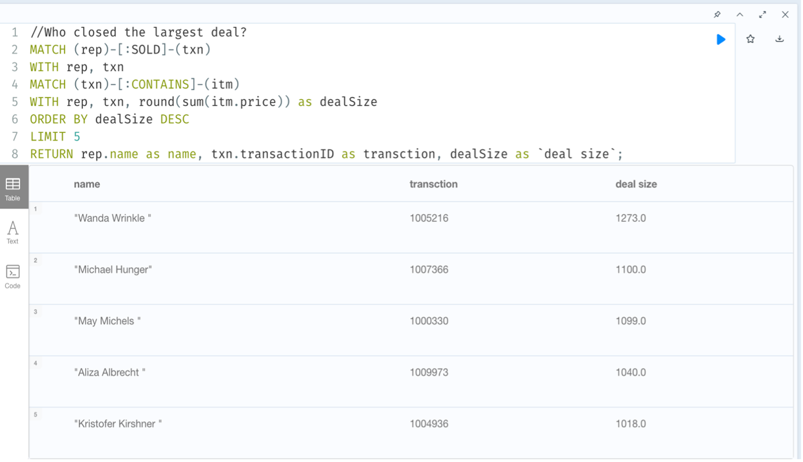
    • Graph describing the multi-level marketing system:
    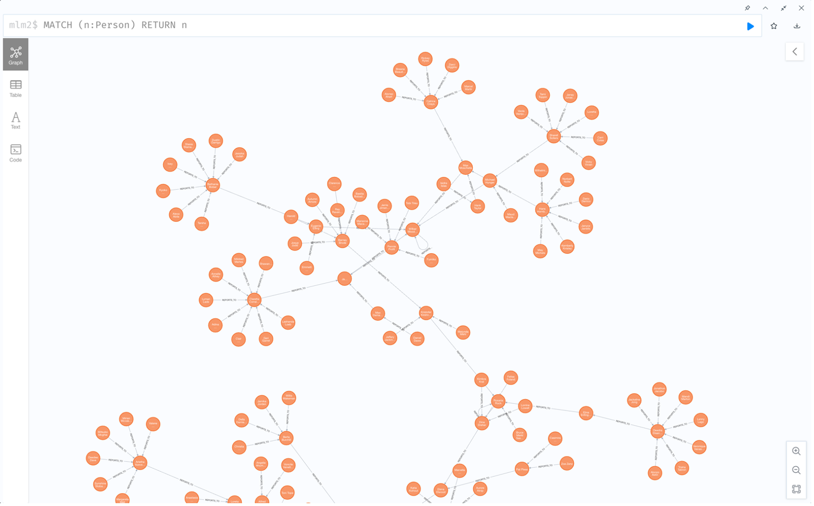

### Summary

    Through the article, we've learned about Neo4j, MLM including what it is, it's basic objects, querying methods, and a quick overview of MLM with some Cypher queries for querying the multi-level marketing graph database. Have a great day !

